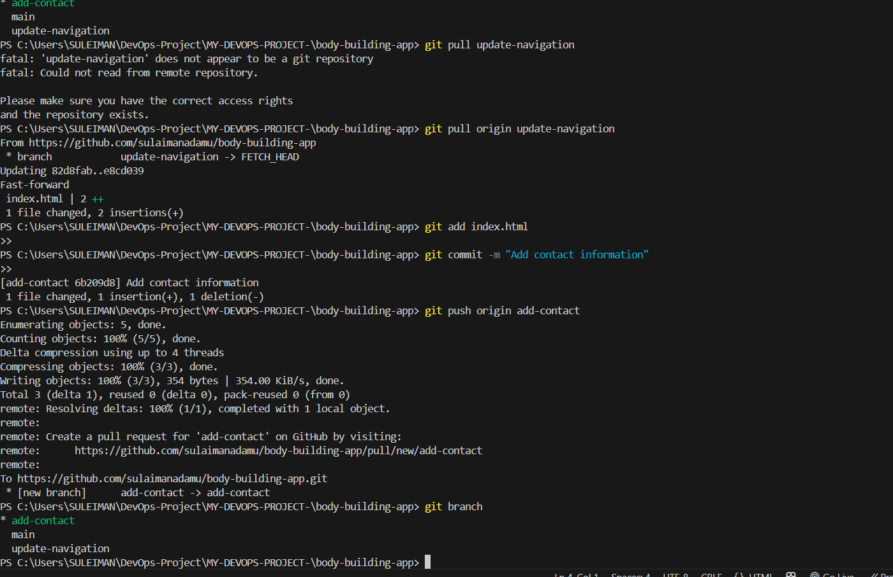
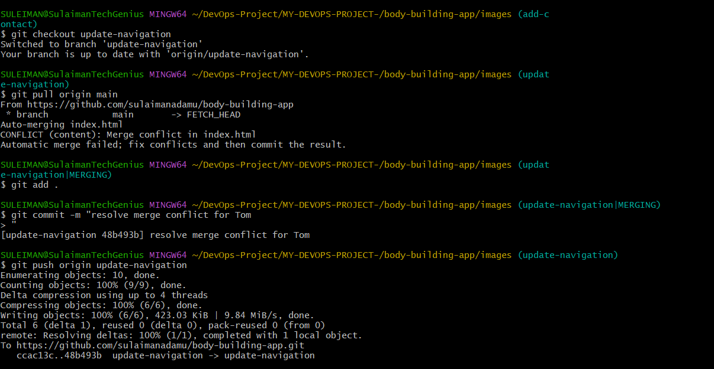
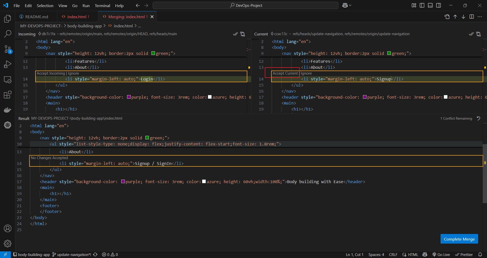
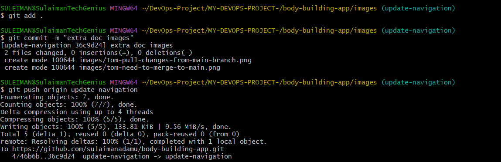
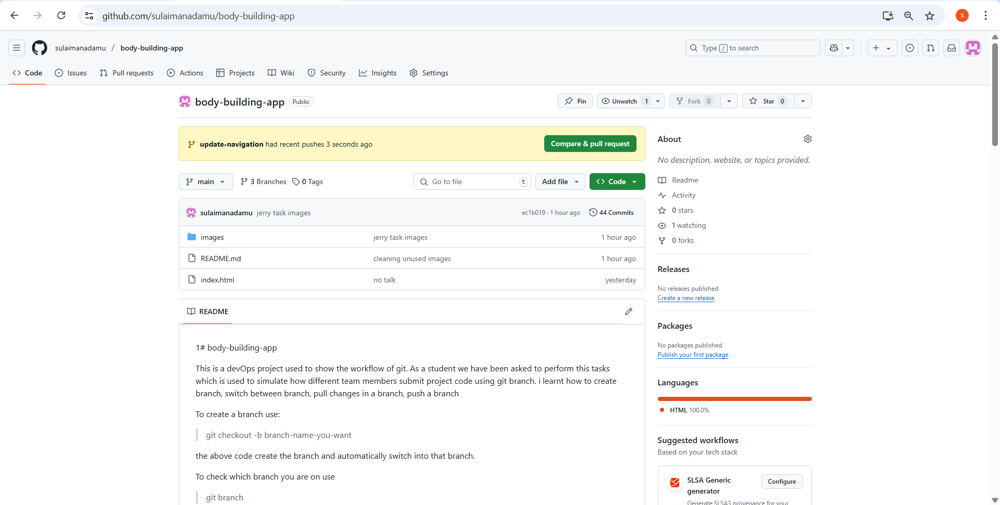
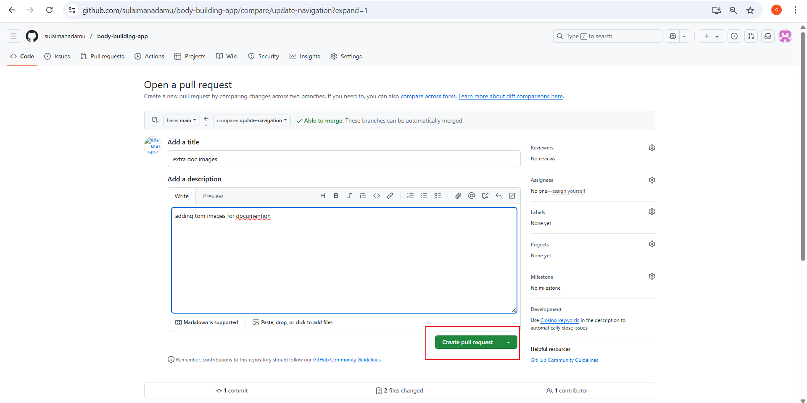

1# body-building-app

This is a devOps project used to show the workflow of git.
As a student we have been asked to perform this tasks which is used to simulate how different team members 
submit project code using git branch. i learnt how to create branch, switch between branch, pull changes in a branch,
push a branch

To create a branch use: 
> git checkout -b branch-name-you-want

the above code create the branch and automatically switch into that branch.

To check which branch you are on use 
> git branch 

This will show you all the branch in your system and the one you are on will be green and prefixed with the symbol *

To switch to another branch use 
> git checkout branch-name

To push changes in a branch to the remote repository use 
> git push origin branch-name

To pull it back, that is to get the changes done on that branch locally you can use 

> git pull origin branch-name

this will pull the branch changes into any branch you are currently on and make the necessary changes so you are up to date.

below are pictures of how what i have explained above was used by me.

here are the merging i did

WORKING OF PULL REQUEST TASK.

Tom pulls in changes in the main branch using 
> git pull origin main

Tom pulls in changes in the main branch using 
> git pull origin main

There was a conflict which was resolved as shown in the image follow  the one below.

resolving the conflict for tom

after accepting which changes to keep, Tom pushed the changes to it branch using 
>git push origin update-navigation

Tom push changes to the update-navigation branch

Tom made a pull request with it new changes.

Tom describes the reason for the pull request

Tom pull request was accepted and merge by team member.

Tom pull request merge successful message

----------------------------------------------------------

==========================================================

==========================================================

jerry push changes to the add-contact branch

jerry made a pull request with it new changes.

jerry describes the reason for the pull request

jerry pull request was accepted and merge by team member.

jerry pull request merge successful message

