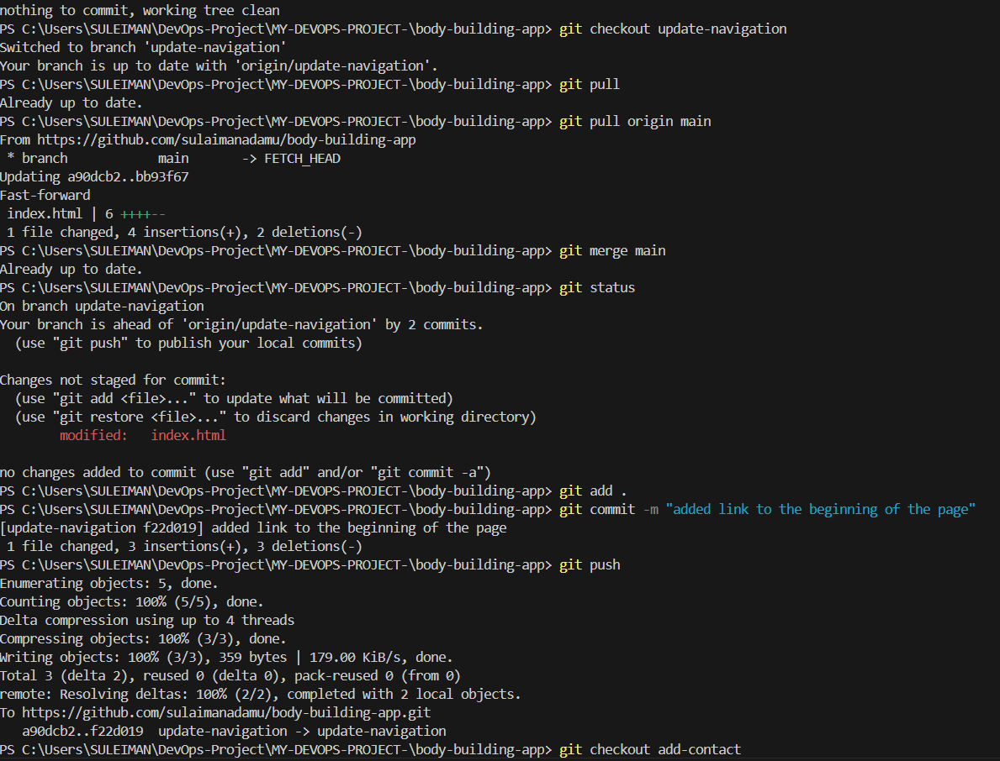
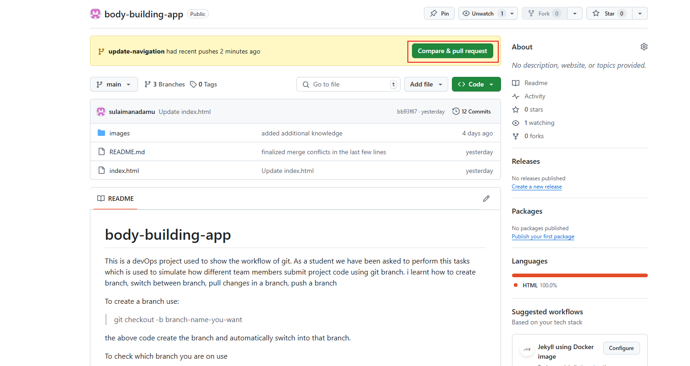
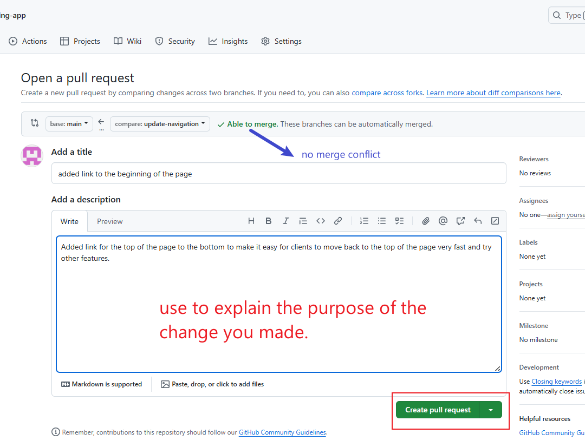
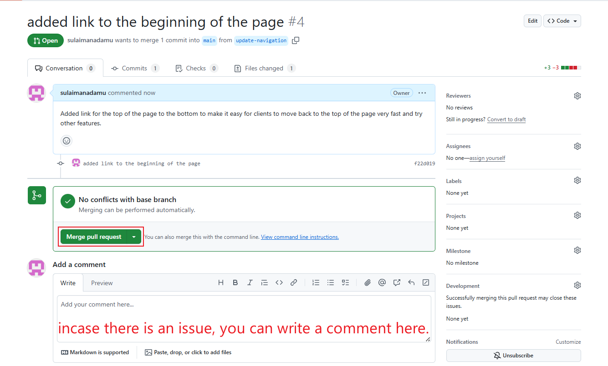
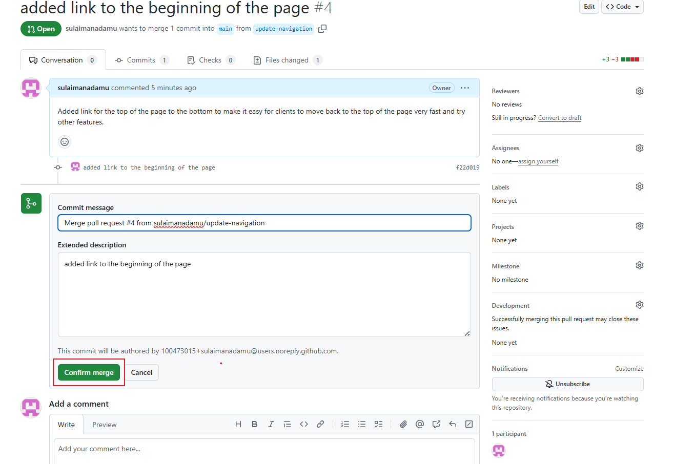

When a change is pushed to the remote repository, the code has to be reviewed before being added to the main branch by someone on the team. 

here is a process i did that i pushed to the branch in the image below and how i created a pull request(PR)

here are the steps to make a pull request and merge it.

